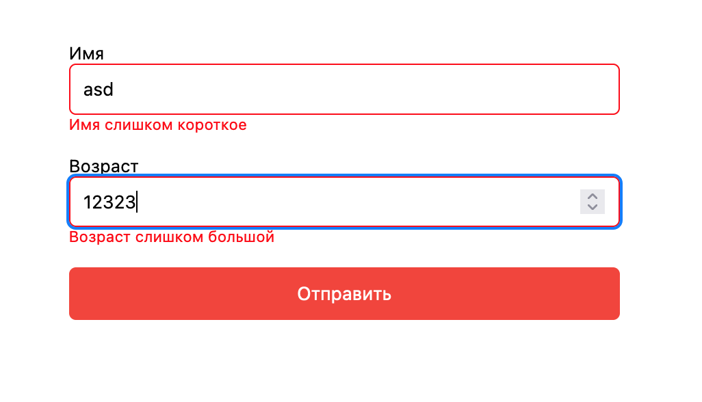
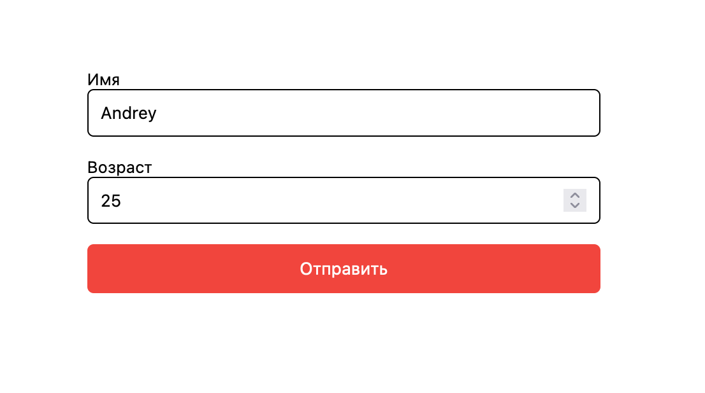

# Валидация форм

Ранее, валидация формы обычно происходила на сервере после того, как клиент ввел все необходимые данные, а затем нажал кнопку «Отправить». Если данные, введенные клиентом, были неверными или просто отсутствовали, сервер должен был отправить все данные обратно клиенту и запросить повторную отправку формы с правильной информацией. Это был действительно длительный процесс, который сильно нагружал сервер.

С помощью JS и HTML можно делать это на стороне клиента. Проверка формы обычно выполняет две функции:

- Базовая проверка.
  Прежде всего, форма должна быть проверена, чтобы убедиться, что все обязательные поля заполнены. Для этого потребуется просто пройтись по каждому полю в форме и проверить данные.
- Проверка формата данных.
  Введенные данные должны быть проверены на соответствие формата и значения. Ваш код должен включать соответствующую логику для проверки правильности данных.

### Валидация форм с помощью HMTL

В HTML5 проверка формы является встроенной функцией. HTML 5 предоставляет различные атрибуты проверки.
Когда ввод формы действителен, псевдокласс `:valid` CSS применяется к элементу. Если он недействителен, то к элементу применяется псевдокласс CSS `:invalid`.
Когда форма имеет недопустимые входные данные, браузер блокирует отправку формы и отображает сообщение об ошибке.

## HTML аттрибуты для валидации

### Pattern

Аттрибут `pattern` позволяет нам установить регулярное выражение в качестве значения, которое будет проверено браузером.

Доступен для элементов ввода с текстом типа `text`, `search`, `url`, `tel`, `email`, и `password`.

### Min

- Проверяет является ли введенное число значением минимального атрибута или выше.
- Когда он применяется к элементу даты, месяца или недели, он проверяет, является ли дата больше или равна той, которая указана в значении этого атрибута.

Доступен для элементов ввода с текстом типа `range`, `number`, `date`, `month`, `week`, `datetime`, `datetime-local`, и `time`.

### Max

Атрибут `max` противоположен атрибуту `min`. Он проверяет меньше ли или равно введенное значение тому, что указано в значении этого атрибута.

### Required

Проверяет, введено ли входное значение пользователем.

### Step

Атрибут `step` проверяет, является ли ввод целым числом.

### Minlength

Проверяет наличие минимального количества символов.

### Maxlength

Проверяет количество символов на допустимый максимум.

## Использование

Для примера напишем форму, которая принимает адрес электронной почты в качестве входных данных.

```html
<form id="form">
  <label for="email">What's your email address?</label>
  <input id="email" name="email" required pattern="[^@]+@[^\.]+\..+" />
  <button type="submit">Submit</button>
</form>
```

Другим примером может быть проверка длины наших входных данных и диапазона. Например, мы можем написать следующий HTML-код, чтобы получить имя и возраст пользователя:

```html
<form id="form">
  <label for="name">Имя</label>
  <input id="name" name="name" required minlength="5" maxlength="20" />
  <br />
  <span id="name-too-short" hidden>Имя слишком короткое</span>
  <span id="name-too-long" hidden>Имя слишком длинное</span>
  <br />
  <label for="age">Возраст</label>
  <input id="age" name="age" type="number" required min="0" max="150" />
  <br />
  <span id="age-too-high" hidden>Возраст слишком большой</span>
  <span id="age-too-low" hidden>Возраст слишком маленький</span>
  <br />
  <button type="submit">Отправить</button>
</form>
```

Добавим немного JS, чтобы также показывать сообщения ошибки:

```jsx
const form = document.querySelector("#form");
const name = document.querySelector("#name");
const age = document.querySelector("#age");
const nameTooShort = document.querySelector("#name-too-short");
const nameTooLong = document.querySelector("#name-too-long");
const ageTooLow = document.querySelector("#age-too-low");
const ageTooHigh = document.querySelector("#age-too-high");
form.onsubmit = (e) => {
  e.preventDefault();
};
name.oninput = (e) => {
  nameTooShort.hidden = true;
  nameTooLong.hidden = true;
  if (e.srcElement.validity.tooShort) {
    nameTooShort.hidden = false;
  }
  if (e.srcElement.validity.tooLong) {
    nameTooLong.hidden = false;
  }
};
age.oninput = (e) => {
  ageTooLow.hidden = true;
  ageTooHigh.hidden = true;
  if (e.srcElement.validity.rangeOverflow) {
    ageTooHigh.hidden = false;
  }
  if (e.srcElement.validity.rangeUnderflow) {
    ageTooLow.hidden = false;
  }
};
```

css:

```css
input:invalid {
  border: 1px solid red;
}
input:valid {
  border: 1px solid black;
}
```

Добавим еще немного стилей:

</img>

Ошибки:

</img>

Внутри каждой функции мы сначала скрываем все сообщения, чтобы не видеть устаревшие, а затем проверяем количество символов в имени, так как мы указали минимальную и максимальную длину.
