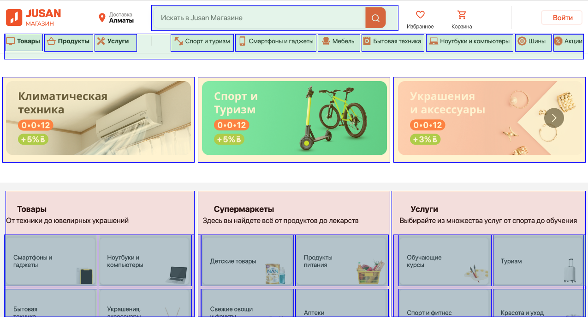

# Компонентный подход

> [Хорошо известное правило разработки](https://learn.javascript.ru/webcomponents-intro#komponentnaya-arhitektura) сложного программного обеспечения гласит: не создавай сложное программное обеспечение.
> Если что-то становится сложным – раздели это на более простые части и соедини наиболее очевидным способом.
> Хороший архитектор – это тот, кто может сделать сложное простым.

Суть компонентного подхода в том, чтобы разделить большое приложение на независимые друг от друга компоненты, которые можно будет переиспользовать.

Пример того как можно поделить сайт на компоненты:
</img>

Компоненты позволяют реализовывать «атомарные» части пользовательского интерфейса один раз и независимо друг от друга.

Этот подход применим не только к вёрстке, но и к:

- JavaScript
- CSS
- HTML

Полезные ссылки:

- [Веб-компоненты](https://learn.javascript.ru/web-components)
