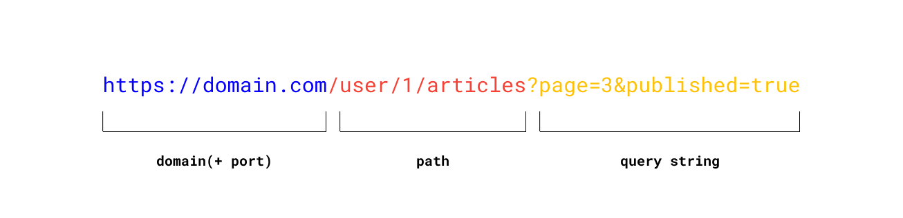

### HTTP Protocol

HTTP — это интернет-протокол. Он определяет правила связи между клиентом и сервером. HTTP не имеет состояния и работает по принципу «запрос-ответ».
Клиент отправляет запрос, относящийся к некоторому ресурсу. Это может быть HTML-сайт, файл или код JavaScript. HTTP не определяет, каким должен быть ресурс. Каждый ресурс имеет свой идентификатор вызова URI. Общая структура URI выглядит следующим образом:

```bash
scheme:[//[user[:password]@]host[:port]][/path][?query][#fragment]
```

Пример:

</img>

URI — это только часть HTTP-запроса. Запрос состоит из:

- строки запроса с указанием пути, версии протокола и метода HTTP (`URL`)
- заголовков (`headers`)
- тела запроса (`body`)

## Методы

Для взаимодействия с объектами на сервере есть 4 метода.
Сокращенно CRUD:

- `POST` - Create
- `GET` - Read
- `PUT/PATCH` - Update
- `DELETE` - Delete

## Headers

Поля заголовка `HTTP` предоставляют необходимую информацию о запросе или ответе или об объекте, отправленном в теле сообщения. Существует четыре типа заголовков сообщений HTTP:

- **Общие**: эти поля заголовка имеют общее применение как для сообщений запроса, так и для сообщений ответа.
- **Заголовок запроса клиента**: эти поля заголовка применимы только к сообщениям запроса.
- **Заголовок ответа сервера**: эти поля заголовка применимы только к ответным сообщениям.
- **Заголовок сущности**: эти поля заголовка определяют метаинформацию о теле сущности или о ресурсе, указанном в запросе, если тело отсутствует.

### Общие

Пример:

- `Cache-Control`
- `Connection`
- `Date`
- `Transfer-Encoding`

### Заголовок запроса клиента

Пример:

- `Accept`
- `Accept-Encoding`
- `Authorization`
- `Cookie`

### Заголовок ответа сервера

- `Accept-Ranges`
- `Age`

### Заголовок сущности

- `Allow`
- `Content-Encoding`

## Data (JSON)

Можно передать через query string, но обычно это JSON

```json
{
  "id": 12345,
  "firstname": "some-firstname",
  "lastname": "some-lastname",
  "age": 39,
  "links": {
    "address": "users/12345/address"
  }
}
```

## Коды

Ответ HTTP приходит с кодом ответа. Он сообщает о результате операции. Существуют следующие группы кодов ответов HTTP:

- `1xx` – информационный – указывает на то, что запрос получен и процесс продолжается. Примеры: 100 — Продолжить, 101 — Переключение протоколов.
- `2xx` — успех — когда запрос был получен, понят и успешно обработан. Известные примеры: 200 — OK и 201 — Created.
- `3xx` — перенаправление — клиенту необходимо предпринять дополнительные действия для выполнения запроса, например, 300 — множественный выбор или 301 — перемещено навсегда
- `4xx` — ошибки клиента — указывает на наличие ошибки на стороне клиента, например, 400 — Bad Request или 401 — Unauthorized
- `5xx`- ошибки сервера – сообщает, что произошла ошибка на стороне сервера, например, 500 – Internal Server Error, 501 – Unimplemented
