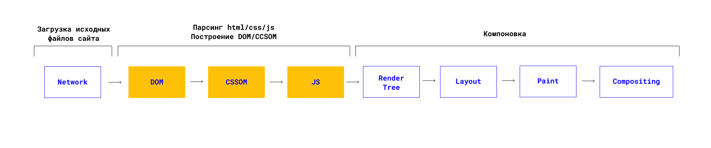
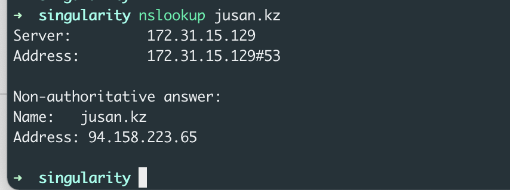

# Как работает браузер

В этом уроке мы углубимся в DOM и CSSOM, чтобы понять, как браузер отображает веб-страницу.

Если кратко: Задача браузера загрузить исходные файлы вебсайта, прочитать их и построить веб-страницу, на основе полученных данных.

Если чуть подробнее:

1. Для начала нужно найти сервер, где находятся исходные файлы
2. Установить соединение с этим сервером (желательно безопасное)
3. Загрузить исходные файлы сайта
4. Прочитать их
5. Построить по ним дерево DOM-узлов
6. Построить дерево стилей
7. Отрисовать страницу по полученным деревьям
8. Загрузить JS файлы
9. Прочитать их и выполнить
10. Перерисовать страницу, если нужно

 </img>

### Как найти ресурсы с исходниками сайта? 📒

Рассмотрим на примере: в адресной строке вы набираете в поисковик доменное имя : `jusan.kz`.
Далее браузеру нужно узнать `IP-aдрес` cервера, чтобы забрать оттуда исходники (всем компьютерам, имеющим доступ в сеть, присвоен некий IP). Чтобы это сделать браузер обращается к `DNS - серверу`.

> DNS-сервер - это сервер-справочник. Он хранит доменные имена и IP-адреса соответствующих им серверов.

Мы можем сами найти ip - адреса используя команду `nslookup`.

 </img>

### TCP-handshake и TLS-соединение 🤝

Узнав адреc браузер установливает TCP-соединение.

После этого происходит процесс передачи данных через `TLS соединение`. Между клиентом и сервером установливается безопасное соединение, данные, передаваемые по нему, шифруются и расшифровываются с использованием симметричной криптосистемы до тех пор, пока соединение не будет завершено.

Далее поговорим про парсинг HTML и CSS ->

[Следующий урок](../parse-html-css/)
