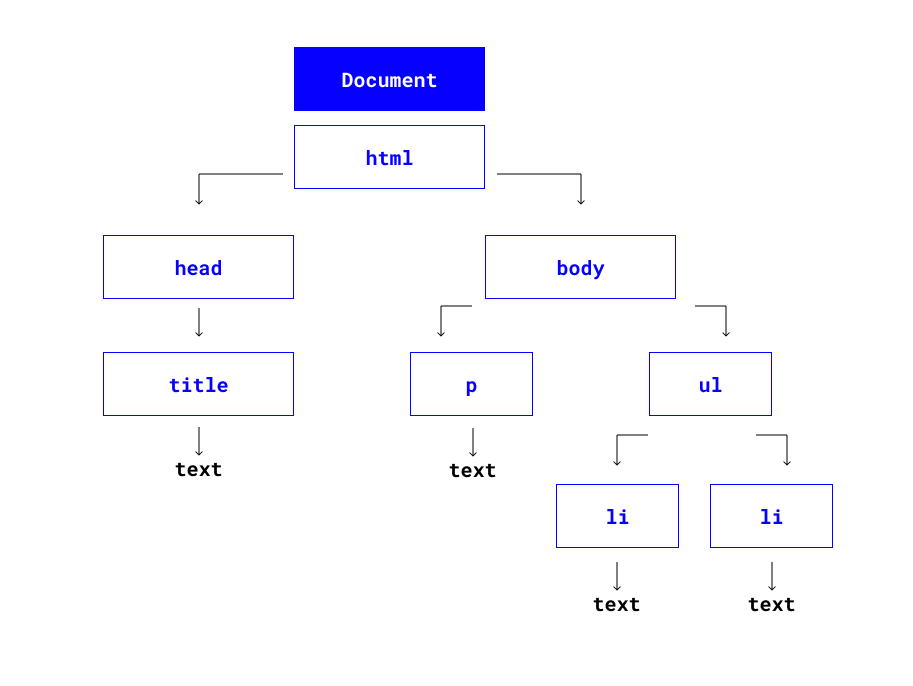
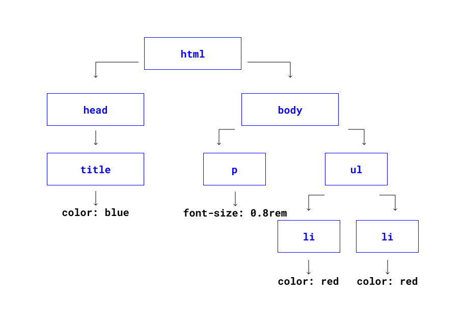
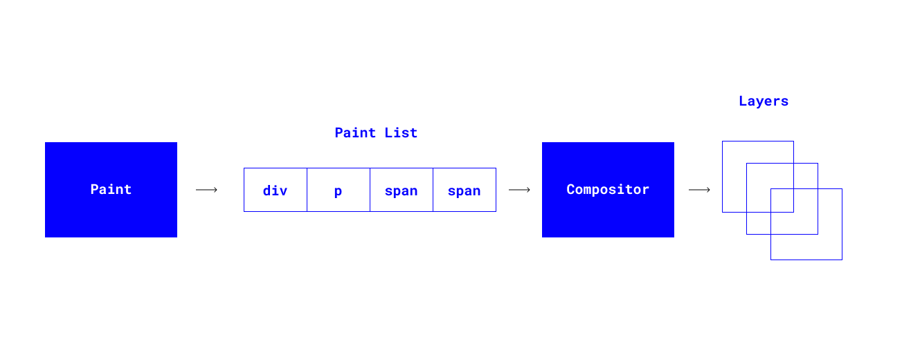

# Парсинг HTML и СSS

### Парсинг HTML

Как только соединение установлено, браузер посылает первый HTTP GET запрос серверу от лица пользователя. Как только сервер получает запрос, он посылает ответ с соответствующими заголовками и, скорее всего, с HTML в содержании. Далее полученные данные нужно прочитать. Тут начинается парсинг.

```bash
Bytes -> Characters -> Tokens -> Nodes -> DOM
```

 </img>

```bash
💡 DOM (Объектная Модель Документа) – это программный интерфейс (API) для HTML и XML документов.
```

### Парсинг CSS

Как только браузер при чтении HTML встретит `<link>` тэг с URL-ом на CSS-файл, 
он начнет загрузку СSS-ресурса, параллельно продолжая парсинг страницы.

Как только CSS-файл загружен, его тоже нужно разобрать:

```bash
CSS Bytes -> Characters -> Tokens -> Nodes -> CSSOM
```

 </img>

```bash
💡 CSS Object Model представляет собой набор API-интерфейсов, позволяющих манипулировать CSS из JavaScript. Это очень похоже на DOM, но для CSS, а не HTML.
```

В начале браузер создает модель визуализации, в которой всем отображаемым объектам из модели DOM задаются стили из модели CSSOM. Браузер ивзлекает из CSSOM наборы стилей и задает их соответствующим объектам.

Каждый отображаемый узел в DOM дереве порождает `RenderObject (Объект отрисовки)`. Все `RenderObjects` содержатся в дереве `RenderTree`.

После этого формируется макет. Нужно рассчитать, какого размера будут объекты и каким образом их нужно расположить в области просмотра. Для этого браузер рассчитывает геометрическую форму объектов, используя для этого анализ модели визуализации с самого начала.

Создав макет, браузер получает **блочную** модель, точно отражающую положение и размеры каждого объекта в области видимости. 

После этого, браузер переходит к этапу Paint для конвертирования модели визуализации в пиксели. Все относительные параметры элементов конвертируются в абсолютное положение на экране, выраженное в пикселях.

Теперь каждый RenderObject знает как отрисовать соответствующий элемент. Это он делает посредстом вызовов команд “draw calls” в GraphicsContext.
GraphicsContext отвечает за запись пикселей в bitmap (конечная растровая картинка), которая в конце концов будет выведена на экране.
Отрисовка обычно выполняется на нескольких поверхностях (слои).

### Компоновка

Элементы страницы могут располагаться на нескольких слоях, поэтому они должны быть выведены на экран в надлежащем порядке.
Это особенно важно для элементов, которые перекрывают другие элементы.

Для этого используется отдельный процесс -компоновщик/Compositor. Ранее браузер уже подготовил список элементов для отрисовки, который уходит в Compositor, и тот понимает, как нужно разбить весь контент на слои, чтобы они были нормально расположены друг относительно друга

 </img>

Далее про подгрузку JS ->

[Следующий урок](../parse-js/)
