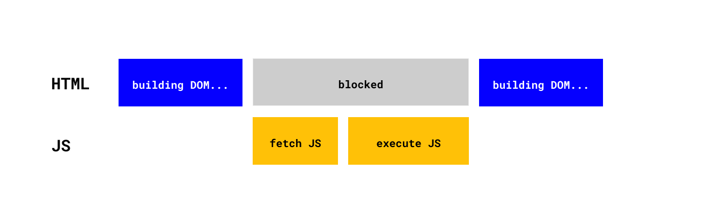

# Подгрузка JS

JavaScript позволяет нам манипулировать как DOM, так и CSSOM. JavaScript блокирует основной поток и останавливает построение DOM. В это время браузер не может обрабатывать события прокрутки, нажатий и др. Вот что происходит:

- Останавливается построение DOM
- Подгружается код JS
- Создается CSSOM, если он еще не создан (CSS блокирует скрипты).
- Выполняется JS-код.
- Возобновляется построение DOM.

Может показаться странным, что CSSOM должен быть создан до выполнения JavaScript. Но это потому, что мы можем попытаться получить доступ к стилю, который еще не определен, например, document.body.style.

</img>

Построение дерева DOM занимает весь поток процесса. Поэтому мы должны тщательно продумать, куда поместить теги скриптов.

Есть 3 cпособа подключить скрипт:

### 1. Встроить в элемент

Используется, чтобы навесить обработчик событий:

```html
<div onclick="code"></div>
```

### 2. Встроить в в заголовок HEAD

Мы можем указать скрипт в заголовке страницы. Сюда можно записывать любой JS-код.

```html
<head>
  <script>
    console.log("JavaScript code goes here!");
  </script>
</head>
```

### 3. Внешние скрипты

Подключение js из внешнего файла. Этот способ увеличивает время блокировки страницы, но позволяет отделить логику от представления, что является обязательным, когда увеличивается количество строк кода.

```jsx
<script src="app.js"></script>
```

[Следующий урок](../html/)
