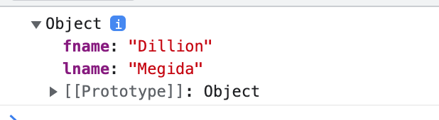
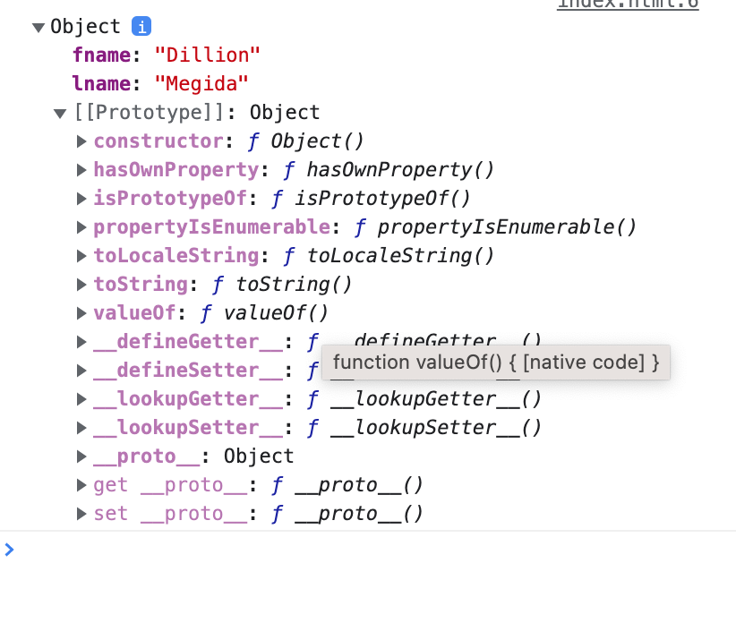

# Прототипы

В JS синтаксис `class` появился не сразу. На самом деле, классы в JS являются просто синтаксическим сахаром. В следующем уроке мы разберем как функционал класса можно реализовать без него. В этом разберем понятие прототипов:

Взгляните на этот код:

```jsx
let names = {
  fname: "Dillion",
  lname: "Megida",
};

console.log(names.fname); // Dillion
console.log(names.hasOwnProperty("mname")); // false
```

Переменная `names` имеет только два свойства — `fname` и `lname` и не содержит методов.

Так откуда взялось `hasOwnProperty`?
Это часть прототипа Объекта.

Попробуйте вывести содержимое переменной в консоль:

```jsx
console.log(names);
```

Вот что покажет консоль разработчика:



Обратите внимание, что помимо `fname` и `lname` у `names` есть свойство `prototype`. Так что же это?

<pre>
<code>
 💡 Прототипы - это механизм, с помощью которого объекты JavaScript наследуют свойства<br> друг от друга. Источник <a href="https://developer.mozilla.org/ru/docs/Learn/JavaScript/Objects/Object_prototypes">MDN</a>.
</code>
</pre>

Если расскрыть cвойство `prototype`, вы увидете некоторые методы и свойства. Все эти свойства исходят из глобального прототипа `Object`. Тут-то и находится метод `hasOwnProperty`.



```jsx
console.log(names.__proto__); // Object
console.log(Object.getPrototypeOf(names)); // Object
```

Другими словами, все объекты имеют доступ к прототипу объекта. Они не обладают этими свойствами, но им предоставляется доступ к свойствам в прототипе.

<pre>
<code>
💡 Про прототипы подробно <a href="https://developer.mozilla.org/ru/docs/Learn/JavaScript/Objects/Object_prototypes">тут</a>.
</code>
</pre>

[Тест](./test-1.md)
