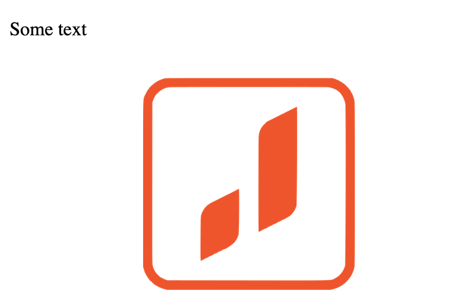

# HTML

Верстка – это про Frontend, в основу которого входит язык разметки `HTML`, базис любого сайта.

> HTML (от англ. HyperText Markup Language — «язык гипертекстовой разметки») — стандартизированный язык разметки документов для просмотра веб-страниц в браузере.
> Веб-браузеры получают HTML документ от сервера по протоколам
> HTTP/HTTPS или открывают с локального диска, далее интерпретируют код в интерфейс,
> который будет отображаться на экране монитора.  
> Ресурс: https://ru.wikipedia.org/wiki/HTML

HTML код состоит из тегов. Это своеобразные блоки, которые преобразовываются в визуальные объекты
Расширение у html файлов - `.html`.

Для примера рассмотрим код `index.html`:

```html
<p>Some text</p>

```

А вот как этот код выглядит в браузере:

 </img>

Тут мы использовали два тега: `<p>` и ``
`<p>` - используется для создания абзацев.
`` - для картинок

### Инструменты для верстки сайта

Для написания `html` кода подойдет любой текстовый редактор. Наиболее популярными являются:

- VSCode
- Sublime Text
- Webstorm
- Atom, и так далее

### C чего начать?

## Поток документа

Поток документов — это расположение элементов страницы. То есть, как каждый элемент занимает место и как другие элементы располагаются соответственно ему.

<pre>
<code>
💡 Гайд по потоку документа <a href="https://doka.guide/html/flow/">тут</a>.
</code>
</pre>

## <!DOCTYPE>

Doctype означает объявление типа документа. Он информирует веб-браузер о типе и версии HTML, используемого при создании веб-страницы. Это помогает браузеру правильно обрабатывать и загружать его.

<pre>
<code>
💡 Про !Doctype <a href="https://doka.guide/html/flow/">тут</a>.
</code>
</pre>

## `<html>`

Тег `<html>` представляет корень HTML-документа. Тег `<html>` является контейнером для всех остальных элементов HTML.

<pre>
<code>
💡 Про html <a href="https://doka.guide/html/html/">тут</a>.
</code>
</pre>

## `<head>`

Тег `head` обычно cодержит метаданные и вызовы скриптов. Он помещается между открывающими тегами <HTML> и <body> в начале HTML-файла.

## `<title>`

Тег `<title>` указывает название документа. Это то, что вы видите на вкладке браузера.

## `<body>`

Элемент `<body>` содержит контент, отображаемый на странице: текст, медиа файлы, теги, код JavaScript и так далее.

## `<h1>...<h6>`

Теги от `<h1>` до `<h6>` используются для разметки заголовков.

## `<p>`

Тег `<p>` превращает текст в абзац.

## `<div>`

Тег `<div>` используется в качестве контейнера для HTML-элементов.

Более расширенный список тэгов можно найти тут:

- https://developer.mozilla.org/ru/docs/Web/HTML/Element
- https://www.javatpoint.com/html-tags

[Следующий урок](../level%204%20css/)
