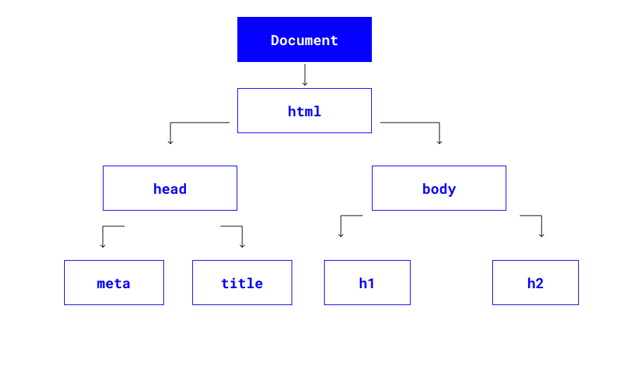

# DOM

В уроке "Как работает браузер" вы уже столкнулись с термином DOM - дерево.

> DOM (Document Object Model) — это специальная древовидная структура, которая позволяет управлять HTML-разметкой из JavaScript-кода. Управление обычно состоит из добавления и удаления элементов, изменения их стилей и содержимого.
> Браузер создаёт DOM при загрузке страницы, складывает его в переменную `document` и сообщает, что DOM создан, с помощью события `DOMContentLoaded`. С переменной `document` начинается любая работа с HTML-разметкой в JavaScript.
> Ресурс : https://doka.guide/js/dom/

Давайте взглянем на этот HTML-код, чтобы лучше понять древовидную структуру DOM.

```html
<!DOCTYPE html>
<html lang="en">
  <head>
    <meta charset="UTF-8" />
    <meta name="viewport" content="width=device-width, initial-scale=1.0" />
    <meta http-equiv="X-UA-Compatible" content="ie=edge" />
    <title>DOM tree structure</title>
  </head>
  <body>
    <h1>DOM tree structure</h1>
    <h2>Learn about the DOM</h2>
  </body>
</html>
```

`document` называется корневым узлом и содержит один дочерний узел - `<html>`. Элемент `<html>`содержит два дочерних элемента: `<head>`и `<body>`

Оба элемента `<head>`и `<body>` имеют собственные дочерние элементы.

</img>

Мы можем получить доступ к этим элементам в `document` и внести в них изменения с помощью JavaScript.

### Как выделить элементы в документе

Существует несколько различных способов выбора элемента в HTML-документе.

- `getElementById()`
- `querySelector()`
- `querySelectorAll()`

## `getElementById()`

Пример:

```html
<p id="para1">This is my first paragraph.</p>
<p id="para2">This is my second paragraph.</p>
```

```jsx
const paragraph1 = document.getElementById("para1");
console.log(paragraph1); // <p id="para1">This is my first paragraph.</p>
```

Если мы хотим просто прочитать содержимое абзаца, то можем использовать textContent свойство внутри файла и console.log().

```jsx
const paragraph1 = document.getElementById("para1");
console.log(paragraph1.textContent); // This is my first paragraph.
```

## `querySelector()`

Позволяет найти элемент по CSS-селектору среди всех дочерних элементов. Если найдено больше одного элемента, querySelector() вернет первый подходящий. Если элементы не найдены, то вернёт null.

```html
<h1>Favorite TV shows</h1>
<ul class="list">
  <li>Golden Girls</li>
  <li>Archer</li>
  <li>Rick and Morty</li>
  <li>The Crown</li>
</ul>
```

Чтобы вывести в консоль содержимое `h1`:

```jsx
const h1Element = document.querySelector("h1");
console.log(h1Element); //<h1>Favorite TV shows</h1>
```

Чтобы вывести в консоль содержимое класса `list`:

```jsx
const list = document.querySelector(".list");
console.log(list);
/*
<ul class="list">
  <li>Golden Girls</li>
  <li>Archer</li>
  <li>Rick and Morty</li>
  <li>The Crown</li>
</ul>
*\
```

## `querySelectorAll()`

Этот метод находит элементы, подходящие заданному селектору CSS, и возвращает список всех этих элементов.

Чтобы найти все `<li>` элементы в примере выше, необходимо использовать `>` дочерний комбинатор, чтобы вернуть все дочерние элементы `<ul>`.

```jsx
const listItems = document.querySelectorAll("ul > li");

listItems.forEach((item) => {
  console.log(item);
});

/*
 <li>Golden Girls</li>
    <li>Archer</li>
    <li>Rick and Morty</li>
    <li>The Crown</li>
*\
```

### Как добавить новые элементы в документ

Мы можем использовать `document.createElement()` для добавления новых элементов в дерево DOM.

```html
<h1>Безопасность и защита</h1>
```

```jsx
let unorderedList = document.createElement("ul");
document.body.appendChild(unorderedList);

let listItem1 = document.createElement("li");
listItem1.textContent = "Технология безопасных покупок 3D Secure";
unorderedList.appendChild(listItem1);

let listItem2 = document.createElement("li");
listItem2.textContent = "Автоматический мониторинг всех платежей и переводов";
unorderedList.appendChild(listItem2);
```

### Как использовать свойство Style для изменения встроенных стилей CSS

Свойство style дает вам возможность изменить CSS в вашем HTML-документе.

```html
<h1>I was changed to blue using JavaScript</h1>
```

```jsx
const h1 = document.querySelector("h1");
h1.style.color = "blue";
```

Cвойство `style` можно использовать для изменения ряда встроенных стилей CSS, включая `background-color`, `border-style`, `font-size` и т.д.

### Как использовать `addEventListener()` для прослушивания событий на странице

Этот метод позволяет прикрепить событие к элементу HTML, например, к кнопке.
В этом примере, когда пользователь нажимает кнопку, появляется предупреждающее сообщение.

```jsx
<button id="btn">Show alert</button>
```

Это код для добавления прослушивателя событий к button переменной:

```jsx
const button = document.getElementById("btn");
button.addEventListener("click", () => {
  alert("Thank you for clicking me");
});
```

### Заключение

DOM означает объектную модель документа и представляет собой программный интерфейс, который позволяет нам создавать, изменять или удалять элементы из документа. Мы также можем добавить события к этим элементам, чтобы сделать нашу страницу более динамичной.

<pre>
<code>
💡 Дополнительно про DOM можно почитать <a href="https://doka.guide/js/dom/">тут</a>.
</code>
</pre>
