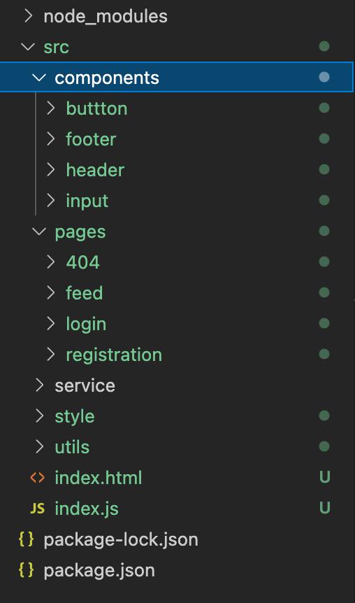
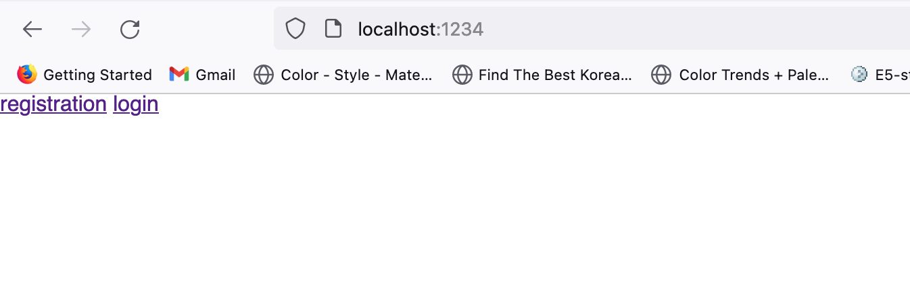
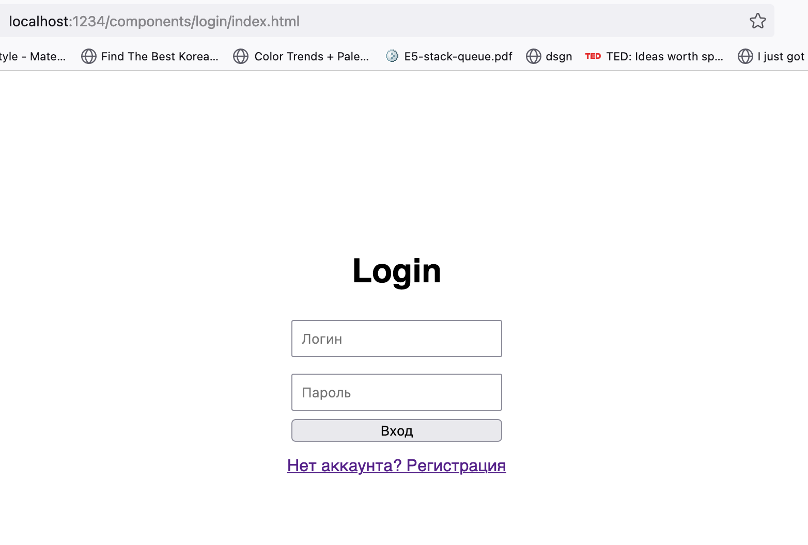

# Структура проекта

Пример структуры файлов вашего проекта:

</img>

Используя компонентный подход, нам нужно будет декомпозировать приложение на части, которые в дальнейшем можно будет переиспользовать. Поэтому можно вынести `button` и `input` в отдельные компоненты. Но об этом позже, пока рассмотрим пример как можно перейти из многостраничного приложения в SPA.

Пример входного `index.html` файла:

```html
<!DOCTYPE html>
<html lang="ru">
  <head>
    <meta charset="UTF-8" />
    <meta name="viewport" content="width=device-width, initial-scale=1.0" />
    <title>Feed</title>
  </head>
  <body>
    <!-- Сделаем две ссылки для переключения между страницами -->
    <a href="./components/registration/index.html">registration</a>
    <a href="./components/login/index.html">login</a>
  </body>
</html>
```

В первой версии приложения мы могли просто переключаться по страницам, подгружая каждый из файлов.

</img>

</img>

Посмотрим на cодержимое `components/login/index.html`:

```html
<div id="login"></div>

<!-- Подгружаем стили и js -->
<script type="module" src="./index.js"></script>
<link rel="stylesheet" href="./index.css" />
```

`components/login/index.js`:

```jsx
const Login = () => {
  let login = `
    <h1>Login</h1>
      <form id='log-form'>
      <input type="text"  name="login" placeholder="Логин">
      <input type="password" id="password" name="password"  placeholder="Пароль">
      <button type="submit">Вход</button>
    </form>
    <a href="/components/registration.html">Нет аккаунта? Регистрация</a>
    `;
  document.getElementById("login").innerHTML = login;
};

Login();
```

Компонент `login` добавляет html код в элемент `login`, тем самым на выходе html файла получаем страницу логин.

В этом примере мы просто немного декомпозировали проект, но этого пока недостаточно для выполнения задания.
