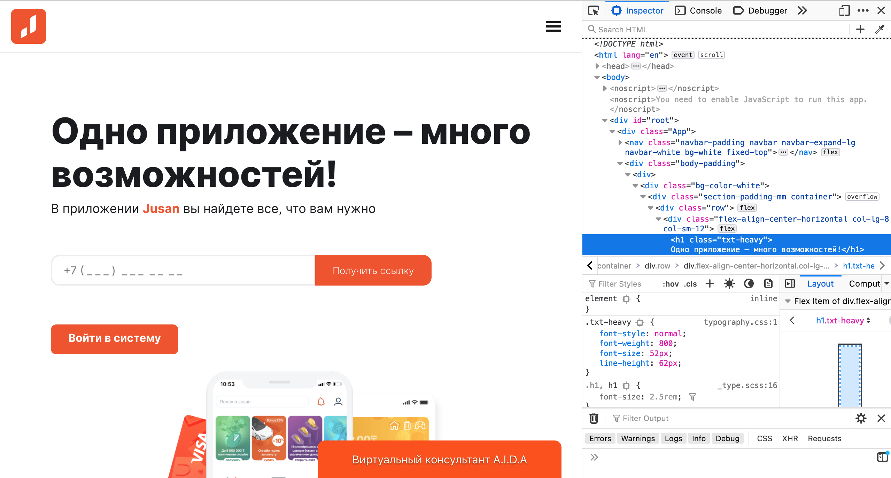

# Что такое фронтенд?

Добро пожаловать в профессию фронтенд разработчика! В этом модуле мы разберем кто такие веб-разработчики, чем занимаются фронтендеры, а также с чего нужно начинать обучение.

Веб разработка состоит из написания сервисов и интерфейсов. За сервисы отвечают backend-разработчики, за интерфейсы - frontend-разработчики.

- **Frontend-разработчик** — программист, который создаёт интерфейс, видимую часть приложения.
- **Backend-разработчик** — отвечает за внутренности, серверную часть сайта.
- **Fullstack-разработчик** — умеет и backend, и frontend.

На сегодняшний день frontend-разработчик - перспективная и стабильная профессия с высокой оплатой. Средняя заработная плата фронтендера по Казахстану составляет 405000 тенге, согласно [исследованию](https://zerttey.kolesa.group/razrabotchiki#zarplata) от Kolesa Group. Зарплата зависит прежде всего от опыта и знаний специалиста.

### Чем занимается фронтенд разработчик?

Фронтендеры работают в связке с дизайнерами. Дизайнер рисует макет - фронтендер его верстает с помощью языков html и css. С помощью встроенных в браузер инструментов разработчиков мы можем увидеть как сверстан сайт, а также какие стили применены к элементам.

Знаний html и css хватит для написания статичного сайта, например для простого лендинга. Для добавления динамики в сайт - например, обработки данных форм, существует язык Java Script. JS - основной язык веб разработчика, его мы разберем позднее.

Помимо всего, фронтенд разработчик должен понимать основы бэкенд разработки. Собранные на сайте данные нужно отправлять на сервер, чтобы их можно было где-то хранить.

### Еще немного о профессии

Суть фронтенд разработчика - создавать сервисы, которые были бы полезны и удобны для людей. Например с приходом банковских приложений стало намного комфортней управлять личными финансами.

Сфера фронтенд разработки постоянно развивается: появляются новые инструменты, и технологии.
