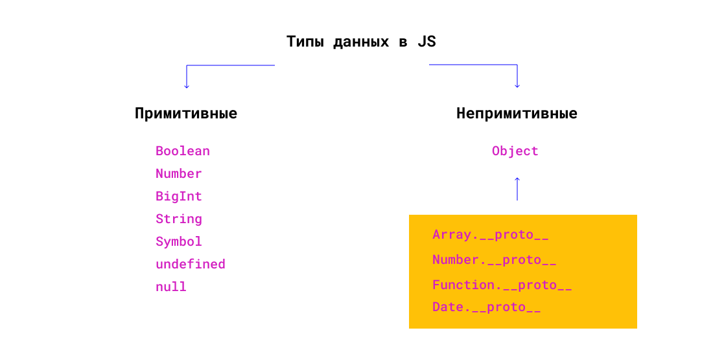

# Функции как классы

Классы в JS - это прототипы объекта. В JS все, что не входит в примитивные типы данных, является объектом.



Перейдем сразу к примеру:

```jsx
class User {
  constructor(name) {
    this.name = name;
  }
  sayHi() {
    console.log(this.name);
  }
}

const user = new User("John");
user.sayHi(); //John
```

Тот же класс можно написать в виде функции:

```jsx
function User(name) {
  this.name = name;
}

User.prototype.sayHi = function () {
  console.log(this.name);
};

const user = new User("John");
user.sayHi(); //John
```

Попробуем посмотреть их типы и прототипы:

```jsx
class User {
  //
}

console.log(typeof User); //function
console.log(User.prototype); //object
```

```jsx
function User() {
  //
}

console.log(typeof User); //function
console.log(User.prototype); //object
```

<pre>
<code>
💡 Эта <a href="https://medium.com/javascript-scene/javascript-factory-functions-vs-constructor-functions-vs-classes-2f22ceddf33e">статья</a> может быть полезна.
</code>
</pre>

[Тест](./test-1.md)
