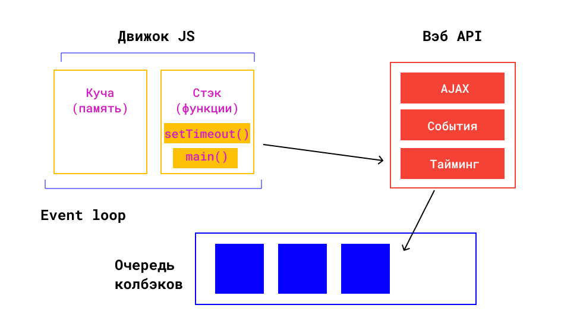

# Цикл событий (Event loop)

И все-таки: как JavaScript может быть асинхронным и однопоточным?

Для начала, `setTimeout()` не является частью JavaScript-движка, это по сути Web API, включённое в среду браузера как дополнительная функциональность. 😮

Эта дополнительная функциональность (Web API) берёт на себя работу с таймерами, интервалами, обработчиками событий. То есть, когда мы регистрируем обработчик клика на кнопку — он попадает в окружение Web API. Именно оно знает, когда обработчик нужно вызвать.

Управление тем, как должны вызываться функции Web API, берёт на себя **цикл событий (Event loop)**.

Цикл событий отвечает за выполнение кода, сбор и обработку событий и выполнение подзадач из очереди.

Именно цикл событий ответственен за то, что `setTimeout()` пропал из стека в прошлом примере. Чтобы увидеть картину целиком, давайте включим в нашу схему все недостающие части. Возьмём тот же самый пример:

```jsx
function main() {
  setTimeout(function greet() {
    console.log("Привет!");
  }, 2000);

  console.log("Пока!");
}

main();
```

Но теперь у нас будет не только стек вызовов — также мы включим **Web API** и **очередь задач**, которую Web API использует для хранения того, что нужно выполнить.



- Список событий, подлежащих обработке формируют **очередь событий**. Когда стек освобождается, движок может обрабатывать событие из очереди. Координирование этого процесса и происходит в **event loop**.

Что происходит с нашим примером с учетом Web Api и очереди событий:

1. Вызов `main`:

| Стек | Web API | Очередь задач |
| ---- | ------- | ------------- |
| main |         |               |

2. Вызов `setTimeout`:

| Стек       | Web API | Очередь задач |
| ---------- | ------- | ------------- |
| setTimeout |         |               |
| main       |         |               |

💡 Когда `setTimeout` исчезает из стека, он попадает в видимость **Web API**, где интерпретатор понимает, что внутри него есть функция `greet`, которую надо выполнить через 2 секунды:

| Стек | Web API           | Очередь задач |
| ---- | ----------------- | ------------- |
| main | setTimeout(greet) |               |

3. После этого выполняется вызов консоли console.log("Пока!"). В **Web API** находится функция `setTimeout(greet)`. Она будет там до тех пор, пока не пройдёт 2 секунды:

| Стек        | Web API           | Очередь задач |
| ----------- | ----------------- | ------------- |
| console.log | setTimeout(greet) |               |
| main        |                   |               |

4. Отработал `console.log`, заканчивается работа `main`:

| Стек | Web API           | Очередь задач |
| ---- | ----------------- | ------------- |
| main | setTimeout(greet) |               |

5. `main` отработал, стек пуст. 2 секунды ещё не прошло, поэтому `setTimeout(greet)` все ещё в Web API:

| Стек | Web API           | Очередь задач |
| ---- | ----------------- | ------------- |
|      | setTimeout(greet) |               |

6. Наконец, 2 секунды прошли - функция `greet` перемещается в очередь задач:

| Стек | Web API | Очередь задач |
| ---- | ------- | ------------- |
|      |         | greet         |

7. Теперь цикл событий перемещает функцию greet из списка задач в вызов:

| Стек  | Web API | Очередь задач |
| ----- | ------- | ------------- |
| greet |         |               |

8. Затем вызов `console.log("Привет!")`:

| Стек        | Web API | Очередь задач |
| ----------- | ------- | ------------- |
| console.log |         |               |
| greet       |         |               |

И наконец стек пуст.

Заметьте, что стек вызовов и очередь задач называются именно стеком и очередью. Потому что вызовы из стека работают по принципу «последний зашёл, первый вышел» (LIFO: last in, first out), а в очереди — по принципу «первый зашёл, первый вышел» (FIFO: first in, first out).

<pre>
<code>
💡 Про Event Loop на MDN <a href="https://developer.mozilla.org/ru/docs/Web/JavaScript/EventLoop">тут</a>.
</code>
</pre>

<pre>
<code>
💡 Про Event Loop на доке <a href="https://doka.guide/js/async-in-js/#cikl-sobytiy">тут</a>.
</code>
</pre>

[Тест](./test-1.md)
