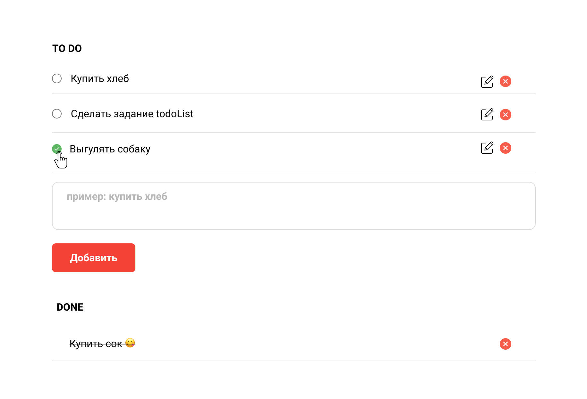

# todoList

В этом уроке вы должны будете написать простой инструмент для организации ваших дел. Задание выполняется используя `html`, `css` и `js`. Запрещено использование сторонних библиотек.

Как должна выглядеть ваша страница:

</img>

Линк на фигму - [figma.com](https://www.figma.com/file/WHT8kQJsIXMcdZ7Ldv5uAZ/singularity-todo-task?node-id=0%3A1)

### Задание

#### 1. Пройти по ссылке задания в GitHub Classroom

Задание выполняется в GitHub Classroom. После выполнения пришлите свою ссылку на рецензию ревьюеру в Stepik ([ССЫЛКА GITHUB CLASSROOM])

#### 2. Добавьте README.md c описанием проекта

Посмотреть пример можно тут:

- https://www.makeareadme.com/
- https://docs.github.com/en/get-started/writing-on-github/getting-started-with-writing-and-formatting-on-github/basic-writing-and-formatting-syntax

#### 3. Использовать следующую структуру файлов:

```bash
- src
    - index.level 2 html
    - js
        - app.js
    - style
        - style.level 4 css
```

#### 4. Добавьте разметку страницы в `index.html`

В странице должно быть как минимум:

- `<input>` для записи задач в список
- `<button>` для для добавления новой задачи в список
- список задач, который пополняется с помощью JS

#### 5. Добавьте стили страницы в style.css

#### 6. Добавьте логику JS в app.js

- Создайте структуру для хранения списка

```jsx
let todos = [];

let newTodo = { id: generateID(), content: "Купить хлеб", date: new Date() };
todos.push(newTodo);
```

- Подпишитесь на события нажатия кнопки `btn.addEventListener("click", eventName);`
- Подпишитесь на изменения input `input.addEventListener("keypress", eventName);`

### Список todo

#### 7. Добавление элемента

- При нажатии на кнопку "Добавить" - нужно добавить текст из инпута в список дел
- После нажатия на кнопку "Добавить" нужно обновить `input` - `input.value = ""`
- Если `<input>` пустой - свойство кнопки "Добавить" должно быть `disabled`. Поменяйте цвет фона кнопки
- Нажатие на клавишу `enter` после ввода должно добавить в список текст из инпута

#### 8. Таймер

- Покажите `alert` через 10 секунд после создания дела.

```jsx
setTimeout(() => alert(`🛎 Не забудь про: ${text}`));
```

#### 8. Отображение списка

- Если список пустой - покажите сообщение `Список еще пуст`
- Каждый элемент в списке должен содержать:
  - текст дела
  - реальную дату создания в формате `3 Jan 2022 16:30`
  - иконку удалить
  - checkbox
  - иконку edit

#### 9. Список done

- При нажатии на checkbox у списка todo - дело удаляется из списка todo и идет в список done.

#### 10. Удаление элемента

- Добавьте возможность удалить элемент из списка todo
- Добавьте возможность удалить элемент из списка done

#### 11. Редактирование элемента

- Добавьте возможность редактировать элемент в списке todo

#### 12. Input

- У элемента `input` для ввода дела добавьте `placeholder` c примером заполнения.

#### 13. Используйте Best Practices для имен функций и переменных

- Следуйте Best Practices (например - https://thecode.media/variables/)

#### 14. Вам нужно будет объяснить свой код ревьюеру и ответить на вопросы по коду


