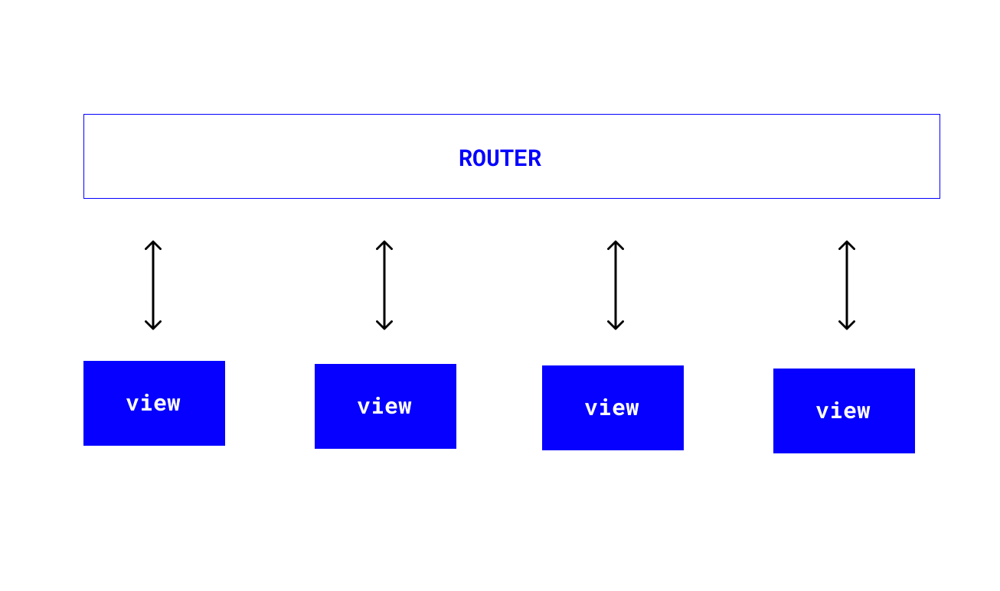
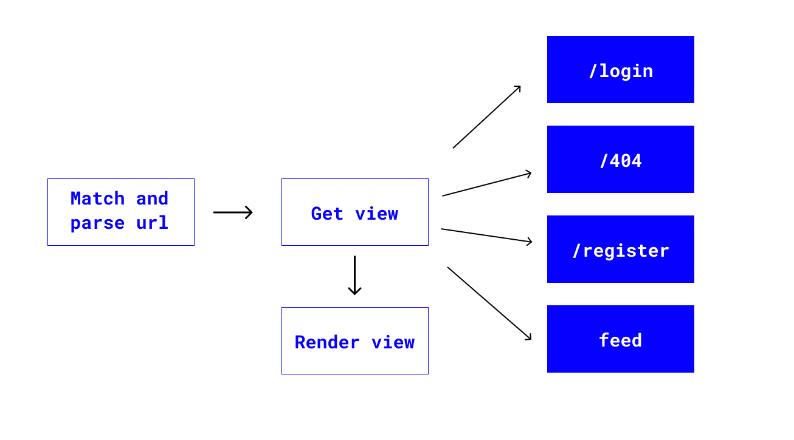
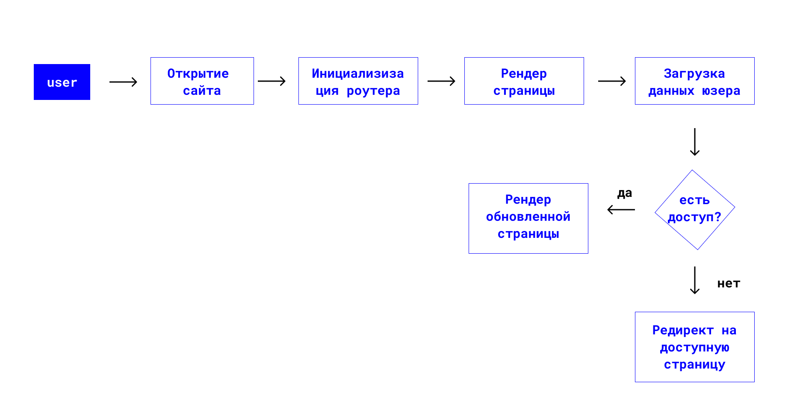

# Роутинг

Простыми словами роутинг - это механизм переключения между вьюшками.

Есть 2 типа роутинга: SSR (server - side rendering) и client side rendering.

> [Рендеринг на стороне сервера (SSR)](https://www.digitalocean.com/community/tutorials/react-server-side-rendering-ru) — это популярная методика рендеринга одностраничного клиентского приложения (SPA) на сервере и последующей отправки на клиент полностью отрисованной страницы. Это позволяет использовать динамические компоненты в качестве статической разметки HTML.

### Роутер

Что такое Javascript-роутер?
Роутер симулирует переходы между страницами, отслеживая изменения в URL-адресе. Когда страница перезагружается или URL-адрес каким-либо образом изменяется, он обнаружит это изменение и отобразит представление, связанное с новым URL-адресом.

</img>

Рендеринг на стороне клиента в современных веб-приложениях — это отображение и переключение вьюшек, отслеживая адресную строку. JS имеет доступ к адресной строке браузера через `window.location`.

</img>

Рассмотрим пример:

Возможные роуты для отслеживания:

```jsx
import Login from "./pages/login";
import Error404 from "./pages/404";

const routes = [
  {
    path: "/404",
    view: Error404,
  },
  {
    path: "/login",
    view: Login,
  },
  //...
];
```

Пример самого простого роутера:

```jsx
const router = async () => {
  // Сравниваем location.pathname и наши роуты
  let isMatch = routes.map((route) => {
    return {
      route,
      isMatch: route.path === location.pathname,
    };
  });
  let match = isMatch.find((route) => route.isMatch);

  if (!match) {
    match = {
      route: routes[0],
      isMatch: true,
    };
  }
  let matchedView = match.route.view;

  // Меняем содержимое #app на вью
  document
    .querySelector("#app")
    .appendChild(await matchedView.prototype.render());
};
```

`index.html`:

```html
<!DOCTYPE html>
<html lang="ru">
  <head>
    <meta charset="UTF-8" />
    <meta name="viewport" content="width=device-width, initial-scale=1.0" />
    <title>Feed</title>
  </head>
  <body>
    <div id="app"></div>

    <script type="module" src="./index.js"></script>
    <link rel="stylesheet" href="style.css" />
  </body>
</html>
```

Бизнес - логика приложения:

</img>

Полезные ссылки:

- [History API](https://developer.mozilla.org/ru/docs/Web/API/History)
