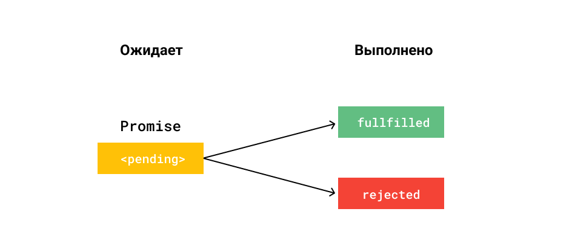
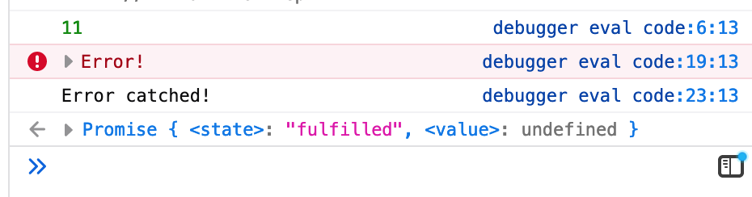

# Промисы (Promises)

Промис — это обещание, которое выполняется при определенных условиях. Если условие истинно, то промис будет разрешен, если нет, то отклонен.

Он используется для обработки результата асинхронной операции. Промис может использоваться для блокировки выполнения фрагмента кода.

Промис — это специальный объект, который может находиться в одном из трёх состояний:

- `pending` — ожидание,
- `fulfilled` — исполнено успешно,
- `rejected` — исполнено с ошибкой.

</a>

Рассмотрим сигнатуры промисов:

```jsx
const promise = new Promise(function (resolve, reject) {
  // Здесь можно выполнять любые действия
  // вызов resolve(result) переведёт промис в состояние fulfilled
  // вызов reject(error) переведёт промис в состояние rejected
});

// Можно создать сразу «готовый» промис
const fulfilled = Promise.resolve(result);
// const fulfilled = new Promise((resolve, _) => resolve(result));
const rejected = Promise.reject(error);
// const rejected = new Promise((_, reject) => reject(error));
```

Например:

```jsx
const promise = new Promise(function (resolve, reject) {
  // что-то делаем

  resolve("success"); // или
  // reject(new Error('failure'));
});

promise
  .then((res) => console.log(res)) // success
  .catch((err) => console.error(err)); // failure (если сделаем reject)
```

Промисы позволяют удобно обрабатывать ошибки:

```jsx
const promise = Promise.resolve(11);

promise
  .then((res) => {
    // Выполнится первым
    console.log(res); // 11
    throw new Error("Error!");
  })
  .then((res) => {
    console.log("foo");
  })
  .then((res) => {
    console.log("bar");
  })
  .then((res) => {
    console.log("baz");
  })
  .catch((err) => {
    console.error(err.message); // Выполнится вторым
    return "Error catched!";
  })
  .then((res) => {
    console.log(res);
  }); // Выполнится третьим
```

Результат вывода в консоль:

</a>

С помощью промисов устраним “callback hell”:

```jsx
// Как было:
http.post('/api/v1/signin', user, function (err, resp1) {
  if (err) { return console.error(err); }
  http.get(`/api/v1/chats/${resp1.id}`, function (err, resp2) {
    if (err) {
            return console.error(err);
        }

    http.post(`/api/v1/chats/${resp1.id}/messages`, {info: resp2}, function (err, avatar) {
      if (err) {
                return console.error(err);
            }
      // callback hell
    });
  });
});

// Как стало:
http.post('/api/v1/signin', user)
    .then(resp1 => http.get(`/api/v1/chats/${resp1.id}`))
    .then(resp2 => http.post(`/api/v1/chats/${resp1.id}/messages`, {info: resp2}))
    .then(...)
    .catch(err => console.log(err));
```

Полезные методы:

<pre>
<code>
💡 Promise.all <a href="https://developer.mozilla.org/ru/docs/Web/JavaScript/Reference/Global_Objects/Promise/all">тут</a>.
</code>
</pre>

<pre>
<code>
💡  Promise.race <a href="https://developer.mozilla.org/ru/docs/Web/JavaScript/Reference/Global_Objects/Promise/race">тут</a>.
</code>
</pre>

<pre>
<code>
💡 Promise.allSettled <a href="https://developer.mozilla.org/ru/docs/Web/JavaScript/Reference/Global_Objects/Promise/allSettled">тут</a>.
</code>
</pre>

Промисы оказались удобными, и появился даже такой термин как _«промисификация»_ — когда асинхронную функциональность на колбэках превращали в промисы.

Однако у них тоже есть несколько недостатков:

- Код не такой лаконичный, как мог быть.
- В цепочке промисов, как на примере (со стрелочными функциями), невозможно выставить брейкпоинт, потому что нет тела функции. Приходится раскрывать функцию.
- Стек ошибок может содержать в себе `then.then.then.then....`
- Вложенные условия сильно увеличивают количество кода и ухудшают читаемость.

Для решения этих проблем придумали асинхронные функции.

<pre>
<code>
💡 Про промисы <a href="https://developer.mozilla.org/ru/docs/Web/JavaScript/EventLoop">тут</a>.
</code>
</pre>

[Тест](./test-1.md)
